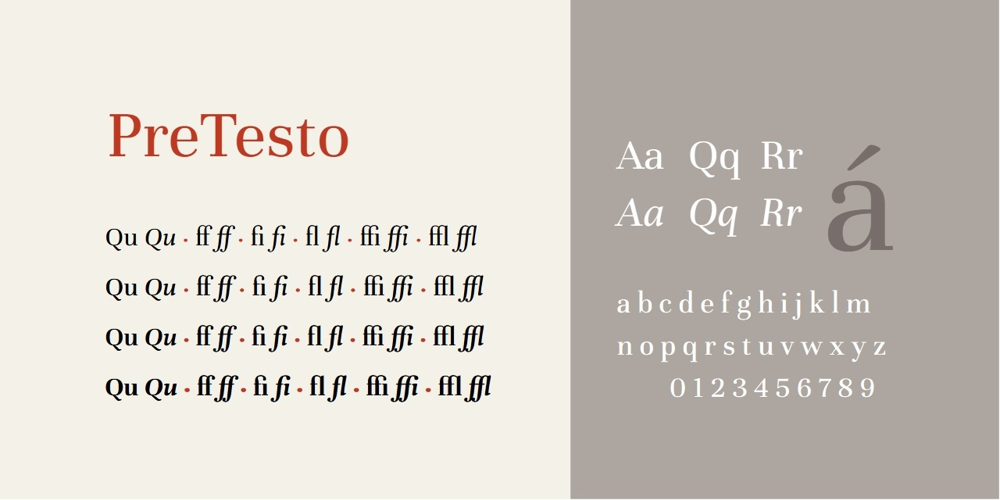

# PreTesto

Versione 1.0: versione iniziale.

Per maggiori informazioni e per testare il font, vedere la [pagina interattiva](https://m-casanova.github.io/PreTesto/).

## Descrizione

"PreTesto" è un font variabile derivato da "[Unna](https://github.com/Omnibus-Type/Unna)" di Omnibus Type (con alcune modifiche).

Il font è rilasciato nei formati WOFF2 e TTF con licenza OFL 1.1 (come già "Unna").
